 

<h1 align=center>GET DUCKED</h1> 

<h2 align=center>Introduction</h2> 

Get Ducked is a full-stack, e-commerce website built using the Django Framework with Python, Javascript, HTML and CSS.

This completely fictional online store provides users with an extensive range of rubber-duck themed gifts from novelty rubber ducks to clothing and jewellery. 

Users of the store are able to browse through the full list of products, apply filters, search particular categories and make a more defined search using a key-word search.  

Once a user has seen an item they like, they can click through to a more detailed view of the product and have the ability to selected the quantity of the item and the size of item (if applicable) and add it to their bag.  They can then continue browsing the store for more products or move directly to the secure checkout.

The secure checkout has been implemented using Stripe and provides a simply form to complete before finalising their transaction.  If the user has already registered for an account, then they are able to save their delivery information for future use and a quicker checkout next time, although unregistered user are also given the option at checkout to sign up to save their information. 

Users will receive email confirmation of their orders and registered users have the ability to log in to their profile to see order information.  Registered users can also update their default delivery address, change their password and reset their password if forgotten.

This store also provides role-based permissions allowing super users full CRUD functionality to add, edit and delete products from the website as and when necessary.

**PLEASE NOTE** As this website is a fictional store and for educational purposes only no real payments should be made via this site.  for testing purposes, the card numbers 4242 should be used as a test card.

[Visit the live site on Heroku](https://get-ducked.herokuapp.com/)

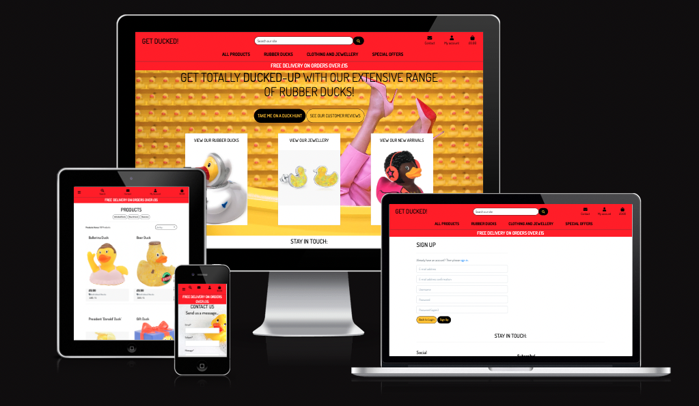

## UX - User Experience Design

## The Strategy Plane

### Concept

This project has been developed as part of the [Code Institute's](https://codeinstitute.net/) Diploma in Full-Stack Software Development with eCommerce. 

<strong>As a Site User:</strong>

NAVIGATION
* I can search through the products using a keyword so I can find a specific item that I would like to purchase.
* I can view a list of products so I can see the full range of products available.
* I can click on a product to see the more information about the product to allow me to make an informed decision about my purchase.
* I can easily search for products by applying filters, searching categories or performing key word searches so that I can easily find a product I am looking for.
* I can navigate easily around the site to find what I am looking for.

REGISTRATION/USER PROFILE
* I can register for an account using my username, email and password.
* I will receive a confirmation email after registering for an account so that I can be sure my order has been received.
* I can log in and out of my account easily to enable me to access/update my personal information.
* I can access my account to view details of my order history.
* I can reset my password regularly to keep my information safe.
* I can regain access to my account if I forget my password.
* I can add and remove items to my wishlist so I can come back and purchase them later.

CHECKOUT
* I can add multiple products to my basket and and see the total price of all items at a glance so I can keep tracks on how much I am spending.
* I can modify the items in my basket easily before checking out.
* I can pay for the items in my basket with the knowledge that my transaction details will be kept secure.
* I will receive a confirmation email when I have made a purchase so I know my order was successful.

OTHER
* I can subscribe to a newsletter so that I can be informed of new products, special offers and discount codes.
* I can add a review to the page to provide feedback about the product and service.
* I can contact the site owner if I wish to know more about a product, the service provided or my order.

<strong>As a Super User:</strong>

* I can view each product so I can review the details and price.
* I can easily add products to the website to provide new and exciting items to the customer.
* I can delete products from the website to remove items that either do not sell well or are no longer available.
* I can update product details such as information and price.
* I can moderate reviews submitted to the website so that only reviews I choose will appear to the public.
* I can delete or edit reviews if necessary.

<strong>Agile Methodology</strong>

All functionality and development of this project were managed using Jira Software Kanban Board which can be found here:

[Get Ducked - USER STORIES](https://getducked.atlassian.net/jira/software/projects/GD/boards/1)

### Site Goals

* To provide user with a space to search for rubber-ducked themed products
* To provide users with a visually pleasing website that is intuitive to use and easy to navigate
* To provide a website where the purpose is immediately clear
* To provide role-based permissions that allows users to:
    - make purchases easily
    - register for an account
    - create, read, edit and delete their profiles 
* To provide role-based permissions that allow super users to:
    - add, edit and delete products.

### Features planned

* Intuitive and simple design
* Visually appealing site 
* Intuitive navigation across all pages
* Role-based navigation for different users 
* Search - All users can use the search bar to search for products by keyword
* Sorting and Filtering products by categories, price, name or rating
* User Sign Up and Log in/Out
* Custom 404 & 500 error pages for good user experience
* Secure checkout
* Feedback/Reviews page

## The Structure Plane

## Functional Scope

## Database Schema

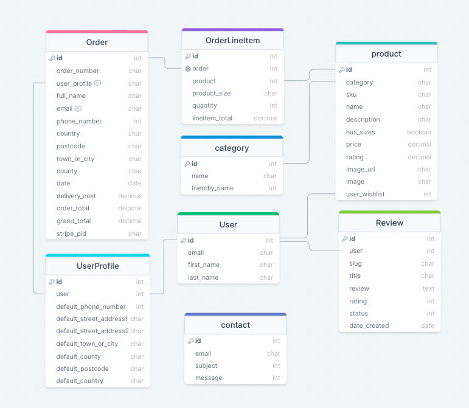

## The Skeleton Plane

## Wireframes 

****** TO DO ******

I used [Balsamiq](https://balsamiq.cloud/) to create low fidelity wireframes which helped me to stay on track during the development process.

Some modifications were made to the initial design during the development process based on user feedback and continuous testing.

**WIREFRAMES TO GO HERE**

## The Surface Plane

## Design

### Color Scheme

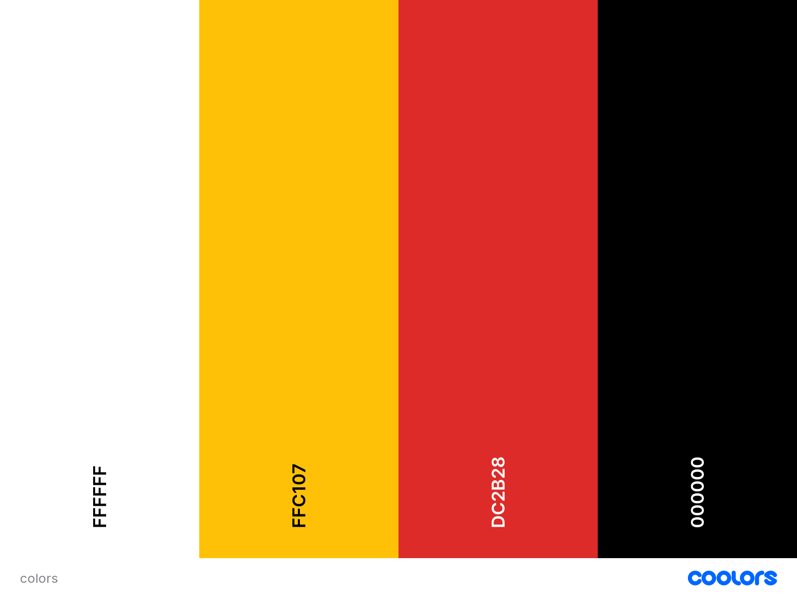

I wanted to keep the color scheme simple and in keeping with the rubber duck theme.  I therefore choose a bright yellow and an orangey red to symbolise the colors of the rubber duck and a ducks beak.  I used a combination of white and black to keep a high color contrast for text and forms on the page.  Buttons were styled using either a black background with yellow text, or a yellow background with black text and the colors would invert when hovered over.

I used [EightShapes Contrast Grid](https://contrast-grid.eightshapes.com) to ensure that all text and background combinations used met the required contrast ratios in compliance with [WCAG 2.0 minimum contrast](https://www.w3.org/TR/UNDERSTANDING-WCAG20/visual-audio-contrast-contrast.html).

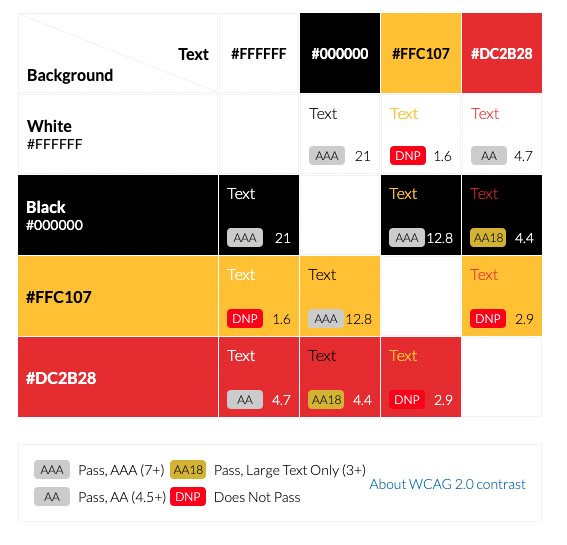

### Typography

Only one font is used throughout the website, sourced from [Google Fonts](https://fonts.google.com/).  'Dosis' was used throughout for it's simple and sleek style and a combination of uppercase for headings and standard case for all other text was used to provide some differentiation.

### Imagery

For the landing page I used an image sourced from [Pexels](https://www.pexels.com/) of a yellow bathtub surrounded by yellow rubber ducks with some ladies legs sticking out of the bath.  It is brightly coloured and adds an element of fun to the website.

All products were sourced from either Amazon, or were pulled from the website [shop4ducks.co.uk](https://www.shop4ducks.co.uk/) <--(great if you're actually looking to buy some rubber ducks!!) and whilst I didn't have explicit permissions to use the images as this website is for educational purposes only and will not be used for profit, I deemed this was acceptable and will credit accordingly at the bottom of this documentation. **CHECK WITH MENTOR THAT THIS IS OK** 

I also sourced a noimage file, in the event that the server cannot find the correct product images to show.  This was sourced via a google search. 

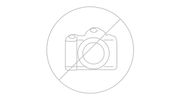

Background-image:  Photo by Snack Toronto: https://www.pexels.com/photo/yellow-steel-bathtub-1630344/

## Features

### Navigation Bar

The main navigation bar allows all users of the site to easily navigate the store and search/sort items in the product list. Users can either search by viewing all products, filtering by category, or entering a keyword in the search bar to receive a list of related products.

On desktop browsers:
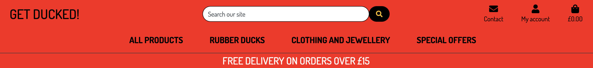

Each category has a drop-down menu and users can further filter/sort the products in a number of ways.  

Users are afforded the same functionality on mobile browsers, but with a more compact nav bar using intuitive icons rather than text to save on screen real-estate and a handy pop-down menu to give the user further options.

Mobile Nav Collapsed:
 

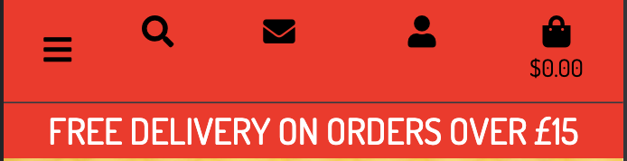
 

Mobile Nav Expanded:
 

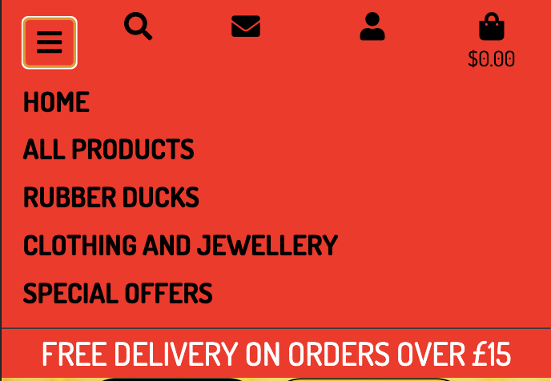

There are also role-based permissions and the dropdown menu associated with 'My Account' reflects this:

General users will see the below options:

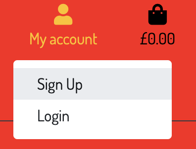

Registered and logged in users will see the following:

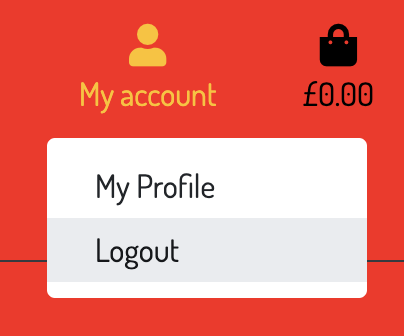

and Admin will have options that allow them to manage the store's products and review, approve, edit or delete customer reviews:

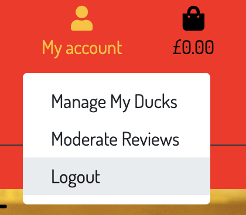

### Footer

The footer appears on every page and gives users plenty of opportunities to connect with the store and includes links to:

* Facebook
* Instagram
* Customer Reviews
* Product Category Pages
* Contact Page
* Privacy Policy
* Email Subscription Service

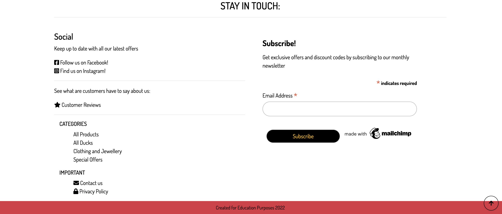

### Product Detail & Wishlist

When a user clicks on a product card, they are taken to the product detail view where they can see more details of the product they are interested in.  The product detail page show the name, price category, rating and a description of the product.  

It also displays a quantity form, so users can increment or decrement the quantity of the item they are wishing to purchase. 

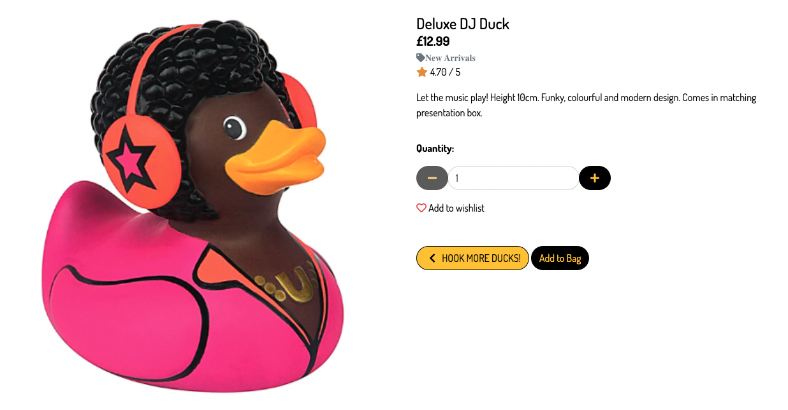

If a user is registered and is logged in, they will also see a 'Add to Wishlist' link which will add the product to their wishlist.  The wishlist link changes dynamically depending on whether the exists in the users wishlist or not and clicking the button will toggle the status to read 'Add to Wishlist' or 'Remove from Wishlist' accordingly.  This allows users to easily see whether they have already added an item to their wishlist or not.

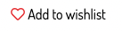  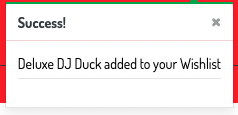

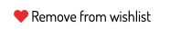 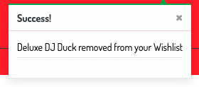

### Profile Page

The profile page allows users to update their address information, view a list of their previous order history and see the items in their wishlist.  Users also have the ability to remove items from their wishlist from their profile page.

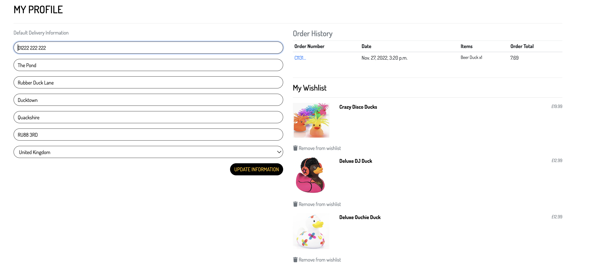

### Other Features

*****TO DO*****

### Future Features/Development

*****TO DO*****

## Testing

Testing has taken place continuously throughout the development of the website. Each view was tested regularly using print statements to ensure the expected outcome was achieved. When the outcome produced was not as expected, debugging was undertaken at that point. I have detailed below some of the bugs that have been resolved and some that remain (due to time constraints/knowledge gaps).

All testing and code validation information can be found in the separate [TESTING.md](TESTING.md) file

* BUG - unable to close toasts with close button.... need to figure out a workaround - sporadic behaviour, sometimes works, sometimes doesn't

* BUG - Increment and decrement quantity buttons not disabling correctly on larger screens.  This is due to two quantity forms being rendered and one being hidden depending on the size of the screen. Unfortunately due to time constraints I was unable to fix this prior to submission as my focus had to be on including all functionality to match the assessment criteria.  This problem however, is not a breaking-bug... If the user selects a quantity of a product of any number below zero, then no items will be added to the bag.  It does however mean that users can add far more of a product to the bag than would be ideal, so this is something that will need to be rectified in the next sprint.

## Technologies Used

* Python
    * The below modules were used for the development of this project
        * asgiref==3.5.2
        * backports.zoneinfo;python_version<"3.9"
        * boto3==1.26.3
        * botocore==1.29.3
        * dj-database-url==0.5.0
        * Django==4.1.2
        * django-allauth==0.51.0
        * django-countries==7.2.1
        * django-crispy-forms==1.14.0
        * django-storages==1.13.1
        * gunicorn==20.1.0
        * jmespath==1.0.1
        * oauthlib==3.2.1
        * Pillow==9.2.0
        * psycopg2-binary==2.9.5
        * PyJWT==2.5.0
        * python3-openid==3.2.0
        * requests-oauthlib==1.3.1
        * s3transfer==0.6.0
        * sqlparse==0.4.3
        * stripe==4.2.0
        * types-cryptography==3.3.23

* Django
    * Django was used as the main framework for the development of this full stack project.
    * Django AllAuth was utilised for user authentication. 

     

* Heroku PostgreSQL was used for the database in production
* SQLite was used as the database for development
* Stripe was used for secure checkout
* Heroku - The project was deployed through Heroku.
* Bootstrap was used for styling
* Balsamiq: Balsamiq was used to create the wireframes during the design process.
* Favicon Generator: Used to create favicon used on the website.
* Font Awesome: Font Awesome was used on all pages to add icons for aesthetic and UX purposes.
* Git: Git was used for version control by utilizing the Gitpod terminal to commit to Git and Push to GitHub.
* GitHub: GitHub is used to store the project's code after being pushed from Git.
* Google Fonts: Google fonts are used to add fonts for aesthetic and UX purposes.
* Multi Device Website Mockup Generator: Used to generate mockup image.
* DrawSQL.app was used to develop the database schema during development.
* Lucidcharts was used to created a flow chart.
* Tinypng
* JPG to WEBP | Cloudconvert
* AWS S3 buckets were used to host media and static files

### Resources

* I relied on Code Institute's Boutique Ado Walkthrough quite heavily for this project.  Due to time constraints/family and work commitments, it was difficult to fully plan a completely unique website, so a lot of the same styling and logic was applied to save time.
* Django Documentation - I relied heavily on the Django official documentation during the build of this project.
* W3C Schools documentation for CSS
* Stripe documentation
* Google
* Stack overflow
* Code Institute's Slack Community.

## Deployment

### Deployment through Heroku

1. Sign up / Log in to Heroku

2. From the main Heroku Dashboard page select 'New' and then 'Create New App'

3. Give the project a name and select a suitable region, then select create app. The name for the app must be unique. This will create the app within Heroku and bring you to the deploy tab. From the submenu at the top, navigate to the resources tab.

4. Add the database to the app, in the add-ons section search for 'Heroku Postgres', select the package that appears and add 'Heroku Postgres' as the database

5. Navigate to the setting tab, within the config vars section copy the DATABASE_URL to the clipboard for use in the Django configuration.

6. Within the django app repository create a new file called env.py - within this file import the os library and set the environment variable for the DATABASE_URL pasting in the address copied from Heroku. The line should appear as os.environ["DATABASE_URL"]= "Paste the link in here"

7. Add a secret key to the app using os.environ["SECRET_KEY"] = "your secret key goes here"
Add the secret key just created to the Heroku Config Vars as SECRET_KEY for the KEY value and the secret key value you created as the VALUE

8. In the settings.py file within the django app, import Path from pathlib, import os and import dj_database_url
insert the line if os.path.isfile("env.py"): import env
remove the insecure secret key that django has in the settings file by default and replace it with SECRET_KEY = os.environ.get('SECRET_KEY')
replace the databases section with DATABASES = { 'default': dj_database_url.parse(os.environ.get("DATABASE_URL"))} ensure the correct indentation for python is used.

9. In the terminal migrate the models over to the new database connection

10. Navigate in a browser to Amazon AWS, log in, or create an account

11. Create a new S3 bucket for the site and create a static directory and media directory within the bucket
12. From the dashboard - copy the bucket details into the settings.py file:
- you will require the following:
- Storage Bucket Name
- Storage Bucket Region Name
- Access Key ID
- Secret Access Key

13.  Add these settings to the env.py file to link AWS:
- os.environ["AWS_ACCESS_KEY_ID"] = 'your access key'
- os.environ["AWS_SECRET_ACCESS_KEY"] = 'your secret access key'

14. Back in Heroku, add the keys and values from AWS and env.py to the config vars

10. In the Settings.py file - add the STATIC files settings - the url, storage path, directory path, root path, media url and default file storage path.
Link the file to the templates directory in Heroku TEMPLATES_DIR = os.path.join(BASE_DIR, 'templates')

14. Change the templates directory to TEMPLATES_DIR - 'DIRS': [TEMPLATES_DIR]

15. Add Heroku to the ALLOWED_HOSTS list the format will be the app name given in Heroku when creating the app followed by .herokuapp.com

16. In your code editor, create three new top level folders, media, static, templates

17. Create a new file on the top level directory - Procfile

18. Within the Procfile add the code - web: gunicorn PROJECT_NAME.wsgi

19. In the terminal, add the changed files, commit and push to GitHub

20. In Heroku, navigate to the deployment tab and deploy the branch manually - watch the build logs for any errors.

Heroku will now build the app for you. Once it has completed the build process you will see a 'Your App Was Successfully Deployed' message and a link to the app to visit the live site.

### Forking the Github Repository

1. By forking the GitHub Repository, you will be able to make a copy of the original repository on your own GitHub account, allowing you to view and/or make changes without affecting the original repository by using the following steps:

2. Log in to GitHub and locate the GitHub Repository At the top of the Repository (not top of page), just above the "Settings" button on the menu, locate the "Fork" button. You should now have a copy of the original repository in your GitHub account.

### Making a Local Clone

1. Log in to GitHub and locate the GitHub Repository Under the repository name.

2. Click "Clone or download". 

3. To clone the repository using HTTPS, under "Clone with HTTPS", copy the link. 

4. Open Git Bash.  

5. Change the current working directory to the location where you want the cloned directory to be made. 

6. Type git clone, and then paste the URL you copied in Step 3.

This project uses Stripe as a payment provider -
1. Create a stripe account at stripe.com
2. Choose developer account to gain access to the api keys required to run the payment processes
3. Once you have successfully created your stripe account:
- Copy the stripe public key, stripe secret key and stripe webhook key into your env.py file and into heroku config vars
- Configure the settings file to find the variables required by stripe.

For more information on how to set up stripe with Django, please refer to the [Stripe Documentation](www.stripe.com).

## Credits

* As this was my first E-Commerce project, I took a lot of inspiration from th [Code Institute's](https://codeinstitute.net/) Boutique Ado walkthrough.  I took inspiration from the models, views and templates to get the skeleton of the project up and running.  I did also add my own custom models for Reviews and Contact and slightly customised the Product model to include a user wishlist.

* Inspiration was taken from this [youtube tutorial](https://www.youtube.com/watch?v=OgA0TTKAtqQ) to create the wishlist functionality.

* Inspiration was also taken from this [youtube tutorial](https://www.youtube.com/watch?v=Zkmu93lMLPs&t=0s) to create the reviews app.

**NOTES FOR ME**

TO DO:
SO MUCH!!!

- 'Are you sure you want to delete { product.name }' popup to prevent accidental product deletion
- Update Jira Board
 - testing?

For Readme:-
Entity-Relationship Diagram
Flow diagram
Testing

