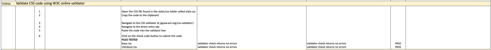
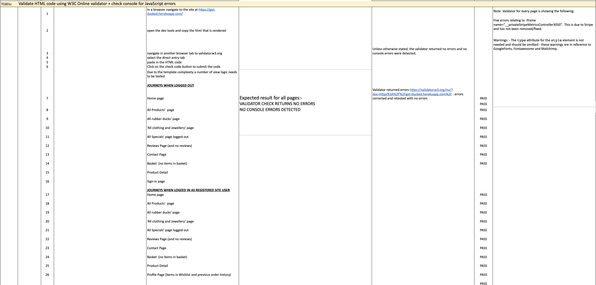
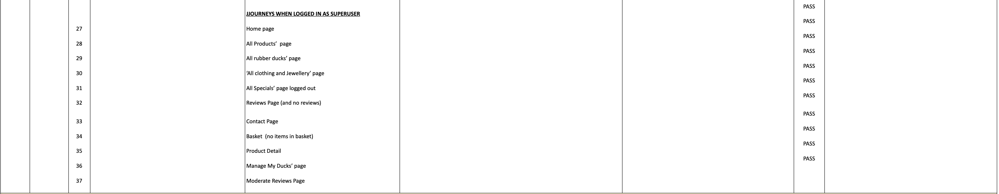
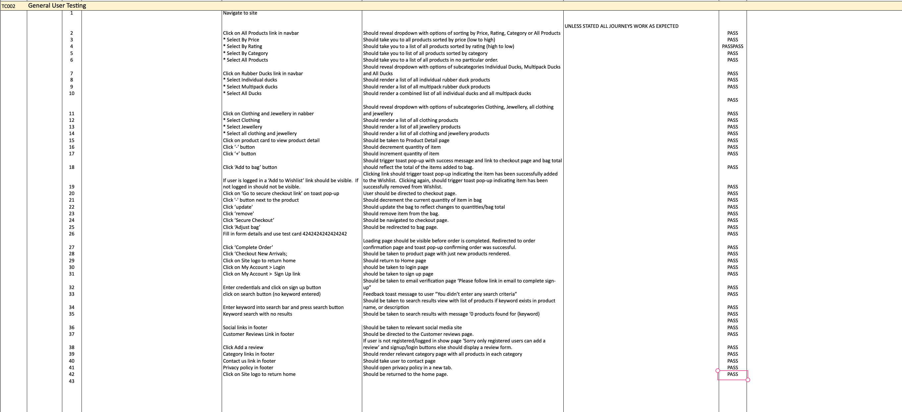
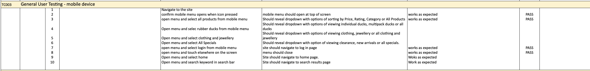
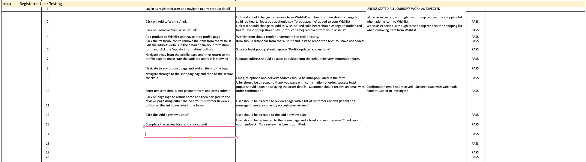
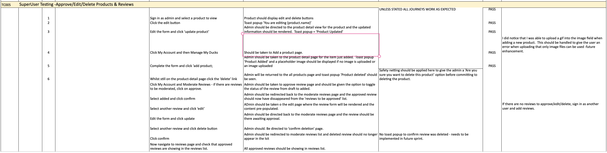

# Testing

Back to the [README.md](README.md)

## Testing Schedule

The full testing schedule report can be found [here](docs/testing/testing-schedule-get-ducked.numbers)

### Test Case 001

### Python Validation - pycodestyle

Python testing was conducted using the pycodestyle linter which was installed into the gitpod workspace.  A few errors were raised in the settings file, however these were related to default django authorisation code and could not be changed to remove the errors.

### Test Case 001a

### JavaScript Validation

Custom JavaScript was validated using [JS Hint](https://jshint.com/). 

A few instances of missing semi-colons were picked up which were rectified and on retesting, no other errors found.  Some warning were noted however, these were relating to third-party JavaScript from Mailchimp and Stripe.

### Test Case 001b

### CSS Validation

   Custom CSS was validated using W3C Jigsaw CSS Validation Service

 

 

### Test Case 001c - 

### HTML Validation

To ensure the HTML was validated correctly, I navigated to the website and used the dev tools to copy the rendered code and pasted this into the validator.  Some errors were returned through the validator initially which were rectified and then re-tested.  Any other errors relate to third party code such as Stripe elements, etc.  These remain as they are, but have been documented in the full testing schedule and links to the validator results can be found within that document.

### Test Case 002

### Manual Testing - General User Navigation

All users have the ability to view the home page, view all products, view product detail, search products,the option to sign up and/or log in if required, add products to their shopping bag and check out.  All navigation and buttons were tested and the outcomes were all as expected. 

### Test Case 003

### Manual Testing - General User - Mobile

Once I knew that all the navigation and buttons were working on desktop, I needed to test on mobile to ensure the navigation toggler worked correctly and the links within also functioned as they should.  All outcomes were as expected. 

### Test Case 004

### Manual Testing - Registered User CRUD functionality

Registered users have the ability to view all products on the site, add, remove and update items in their basket, complete their order through a secure checkout, update their delivery address details and add and delete items from their wishlist.  With the exception of some unexpected behaviour with the toast popups and the customer not receiving an order confirmation email, all outcomes were as expected.

### Test Case 005

### Manual Testing - SuperUser - Testing CRUD functionality for Products and Reviews.

Site Admin/SuperUsers are able to review, add, edit and delete both products and reviews.  During the manual testing I did spot some areas for improvement in future sprints but whilst not breaking bugs I have let them remain for now and will look into these further in the future.  Notably:

1. When adding a product admin can upload other doctypes into the image field.  I would need to get this handled correctly to ensure that only images are able to be uploaded.
2. I noticed that there was no toast popup to confirm that a product had been deleted and to remain consistent across the site, this should be implemented.
3. When Admin chooses to delete a product, they are not taken to a confirmation page to double check that they want to delete the item.  This should be implemented as soon as possible as accidents can happen and buttons can be pressed in error causing the site admin extra work to re-add products if erroneously deleted.

### Wave Webaim Accessibility Report

A few small errors were picked up by the Wave Webaim report which will be fixed in the next sprint.

The full report can be found [here](https://wave.webaim.org/report#/https://8000-shellied-getducked-kzds2ep6qzx.ws-eu77.gitpod.io/)

