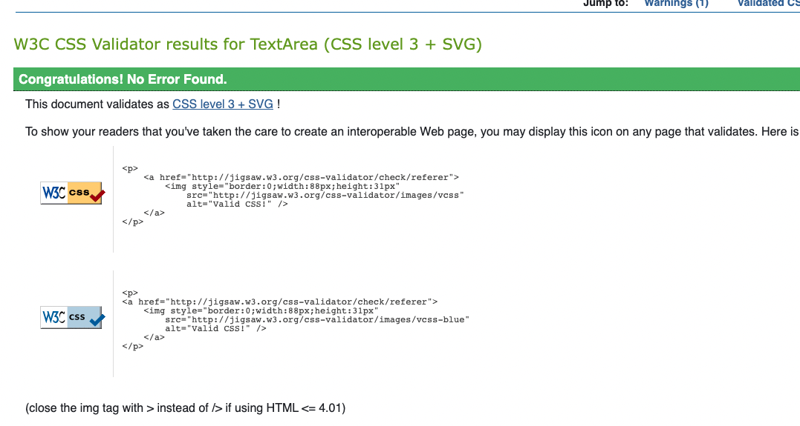

# Testing

Back to the [README.md](README.md)

## Testing Schedule

The full testing schedule report can be found [here]()

### Test Case 001

### Python Validation - pycodestyle

Python testing was conducted using the pycodestyle linter which was installed into the gitpod workspace.  A few errors were raised in the settings file, however these were related to default django authorisation code and could not be changed to remove the errors.

### Test Case 001a

### JavaScript Validation

Custom JavaScript was validated using [JS Hint](https://jshint.com/). 

A few instances of missing semi-colons were picked up which were rectified and on retesting, no other errors found.  Some warning were noted however, these were relating to third-party JavaScript from Mailchimp and Stripe.

### Test Case 001b

### CSS Validation

Custom CSS was validated using [W3C Jigsaw CSS Validation Service](https://jigsaw.w3.org/css-validator/). 

 ------------ TO DO FROM THIS POINT ON! ------------------- 

### Test Case 001c - 

To ensure the HTML was validated correctly, I navigated to the website and used the dev tools to copy the rendered code and pasted this into the validator.  I have not included screenshots of the validator results as they all returned the same and it is impossible to tell from the screenshots which files I am testing. 

### Test Case 002

### Manual Testing - General User Navigation

All users have the ability to view the home page, view all recipes, search recipes and the option to sign up and/or log in if required.  All navigation and buttons were tested and the outcomes were all as expected. 

### Test Case 003

### Manual Testing - General User - Mobile

Once I knew that all the navigation and buttons were working on desktop, I needed to test on mobile to ensure the navigation toggler worked correctly and the links within also functioned as they should.  All outcomes were as expected. 

### Test Case 004

### Manual Testing - Registered User CRUD functionality

### Test Case 005

### Manual Testing - SuperUser 

### Wave Webaim Accessibility Report

A few small errors were picked up by the Wave Webaim report which will be fixed in the next sprint.

The full report can be found [here](https://wave.webaim.org/report#/https://8000-shellied-getducked-kzds2ep6qzx.ws-eu77.gitpod.io/)

### Lighthouse Scores 

Back to the [README.md](README.md)